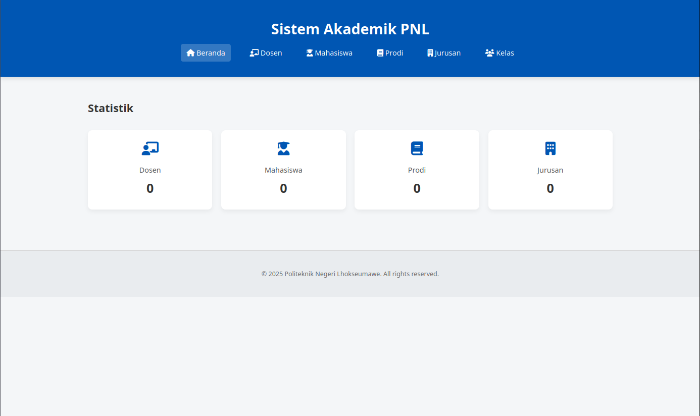

# Sistem Informasi Akademik Kampus

Proyek ini merupakan bagian dari tugas pembuatan sistem database akademik kampus. Aplikasi ini dirancang untuk mengelola data-data penting di lingkungan akademik, seperti data dosen, mahasiswa, jurusan, program studi (prodi), dan kelas.

---

## Fitur Utama

- Menampilkan statistik jumlah dosen, mahasiswa, jurusan, dan prodi  
- Halaman navigasi untuk setiap entitas (dosen, mahasiswa, prodi, jurusan, kelas)  
- Koneksi ke database MySQL menggunakan PHP (PDO)  
- Struktur database relasional untuk data akademik kampus  

---

## Struktur Data

Database `akademik` terdiri dari tabel-tabel berikut:

| Tabel        | Deskripsi                                                                 |
|--------------|---------------------------------------------------------------------------|
| `dosen`      | Menyimpan data dosen: nama, NIDN, jabatan, status, dan kontak            |
| `mahasiswa`  | Data mahasiswa: NIM, kelas, prodi, jurusan, dan data pribadi lainnya     |
| `jurusan`    | Daftar jurusan serta nama kepala jurusan (kajur)                         |
| `prodi`      | Daftar program studi dan nama kepala prodi (kaprodi)                     |
| `kelas`      | Informasi detail mengenai kelas yang tersedia                            |

---

## Teknologi yang Digunakan

- PHP (Plain PHP + PDO)
- MySQL (MariaDB)
- HTML + CSS
- Font Awesome (untuk ikon)
- Git (versi kontrol)

---

## Catatan

> Proyek ini hanya menampilkan fitur dasar sebagai representasi dari sistem informasi akademik.  
> Fitur CRUD lengkap dapat dikembangkan lebih lanjut sesuai kebutuhan.

---

&copy; 2025 — Tugas Mata Kuliah Basis Data smt2
